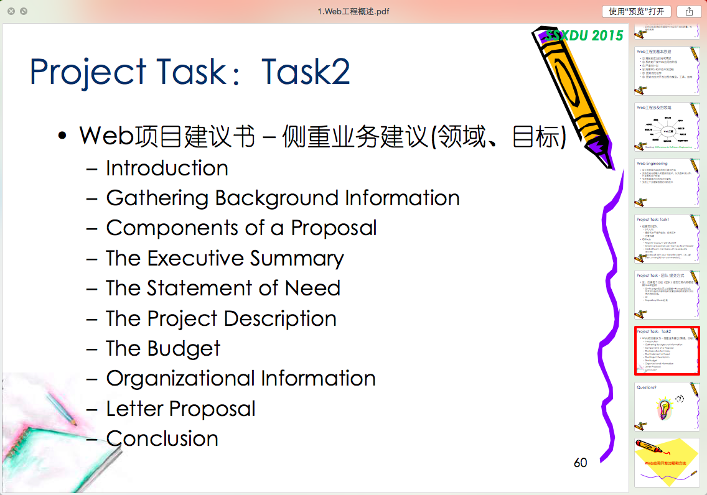

## TODO：Task2



---
## 基本配置

先配置好你的git config  
name 和 email 填写 **Github 的帐号和邮箱！**

```
$ git config --global user.name "Your Name"
$ git config --global user.email "email@example.com"
```

## Fork And Send Pull Requst基本流程

点击右上角的 **fork**  
然后 clone **你 fork 后的仓库**（在你个人主页的repository里面）,下面以我的为例：

```
git clone git@github.com:fjswhl/class2015-websystem.git
```

进入到仓库的PR-test文件夹, 在里面新建一个文件：学号.txt，然后提交并 push（以后你可以对自己 fork 后的仓库随意 push）

```
git add -A  
git commit -m "wip"  
git push origin master  
```

然后进入[本项目主页的Pull Request页面](https://github.com/Class2015-WebSystem/class2015-websystem/pulls)，点击`New Pull Request`, 选择你自己的分支 点击 `create pull request`，这样就 OK 了，

## 怎样把fork后的仓库和主仓库保持同步？

新添加一个名为 upstream的 remote 指向公共仓库
>**这行命令只需要运行一次**

```
git remote add upstream https://github.com/Class2015-WebSystem/class2015-websystem.git
```
>**以下的命令每次同步都要执行**  
>另外推荐使用[SourceTree](http://www.sourcetreeapp.com/), 会自动和主仓库同步

从公共仓库获取 master 分支

```
git fetch upstream
```
合并分支，如果有冲突的话，可以用`sourcetree`之类的客户端手动解决冲突

```
git checkout master
git merge upstream/master
```
