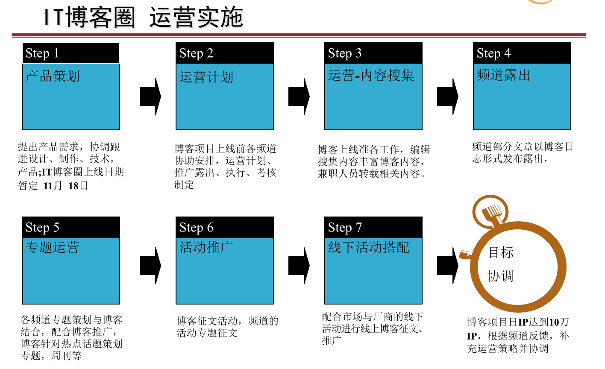

# **博客需求文档**
版本 2015(1.0.6)
编辑日期 2015/07/09

文档详情
===
| 状态 | 文件标签 | BLOG需求文档 |
|-----|-----|-----|
|[] 草稿|版本|2015(1.0.2)|
|[√] 修改中|作者|唐杰真|
|[] 定稿|日期|2015/05/31|

编辑历史
===

| 编辑时间 | 版本 | 作者 |内容|
|-----|-----|-----|-----|
|2015/05/31|2015(1.0.0)|唐杰真|建立文档|
|2015/05/31|2015(1.0.1)|唐杰真|改为md格式|
|2015/06/02|2015(1.0.2)|杨海泉|补充文档|
|2015/06/03|2015(1.0.3)|刘耀东|补充文档|
|2015/06/03|2015(1.0.4)|杨海泉|补充文档|
|2015/06/03|2015(1.0.5)|张昕昳|添加界面图片|
|2015/07/09|2015(1.0.6)|郭鑫|添加运营策略|

---
#**引言**
本需求分析报告目的是规范本web应用的编写，旨在提高应用开发过程中的能见度，便于对开发过程中的控制与管理，同时提出了本应用的开发过程，便于程序员与客户之间的交流协作，并作为工作成的原始依据。同时表明了本应用的共性。

---

# 1  **概述**

 **1.1 产品概述及目标**

   Blog是一个网页上的web应用，由简短且最近更新的帖子构成，这些帖子一般是按照年份和日期倒序排列的。而作为Blog的内容，它可以是你纯粹个人的想法和心得，包括你对时事新闻、国家大事的个人看法，或者你对一日三餐、服饰打扮的精心料理等，也可以是在基于某一主题的情况下或是在某一共同领域内由一群人集体创作的内容。它并不等同于“网络日记”。作为网络日记是带有很明显的私人性质的，而Blog则是私人性和公共性的有效结合，它绝不仅仅是纯粹个人思想的表达和日常琐事的记录，它所提供的内容可以用来进行交流和为他人提供帮助，是可以包容整个互联网的，具有极高的共享精神和价值。

**1.2 背景介绍**
现在虽然已经博客网站泛滥，但是任然缺少能够让用户使用简便，且功能强大，能够满足用户对美的追求的博客网站。

**1.3 产品目的**
创造一个以美为本题，以实用为核心的博客。

**1.4 文档阅读对象**
霍秋艳老师，软件开发人员，测试人员以及客户。

---

# 2  **产品描述**

**2.1 产品整体流程**
![此处输入图片的描述][1]

**2.2 产品需求描述**

本网站系统是以用户为主，用户可以在自己的博客空间发布自己的相关信息，如个人博文，个人相册等个人信息。用户还可以对自己的相关资料做任意的操作。如增加和删除等。当用户登录本网站首页可以在网站首页看到一些好的博文展示。还可在本网站查找并添加和自己志趣相投的博友，可以和他们进行交流。网站还提供了一些最新的新闻热点信息供用户查看。根据用户的需求本博客系统主要可分为以下几个部分。

2.2.1 新闻管理
    新闻管理部分主要是对网站内的所有新闻信息进行管理。用户可以在网页上查看所有的新闻信息或者选择查看个人感兴趣的热点信息，并可以对新闻发表个人评论。网站会对新闻的点击率进行统计，从而将点击率较高的新闻发布道网站的首页，供用户查看。

2.2.2 用户信息管理
用户信息管理部分主要是针对用户进行相关的管理。包括用户的注册，登录，用户的个人信息修改，用户登录信息等等。

2.2.3 图片管理
图片管理主要是针对用户所上传的图片进行相关的管理操作。如用户在个人相册上传了自己的图片，并为图片添加了相关的描述等等。

2.2.4 个人博文管理
个人博文的管理主要是对用户所发表的博文进行管理，用户将自己发布的博文保存在博客空间内，并对博文进行相关的访问权限的设置。根据用户的设置，来评定是否将博文显示到好友的相关信息中。以及对个人博文中的评论信息进行相应的操作，如与评论者进行互动。

2.2.5 歌曲管理
用户可以在自己的音乐盒模块中选择添加自己喜欢的歌曲，以后用户进入空间就可以收听到自己喜欢的歌曲，并且其他用户访问该博客时自动播放音乐盒模块中的音乐。

2.2.6 管理员后台管理
管理员后台管理比较复杂，它包括对各个部分的管理，包括新闻，歌曲，相关文章，用户等。管理员可以对这些信息进行相关的增删改查的操作。

2.2.7 博客模块管理
主要是针对博客界面的模块进行相关的管理操作。提供比如更改模块置放的位置，以及模块的大小等功能。

2.2.8 消息管理模块
主要针对博文的评论信息和系统信息的管理，推送给用户。

**2.3 产品版本规划**

|版本|	主要模块|	功能点	|计划开发时间	|计划结束时间	|备注|
|---|---|---|---|---|---|
|1.0.0|	用户操作模块|	用户常规操作|	2015/06/02	|2015/06/15|
|1.0.0	|后台界面模块|	管理员常规操作|	2015/06/02|	2015/06/15	|
|1.0.0	|客户端界面模块|	管理员常规操作|	2015/06/02|	2015/07/01	|

----

# 3  **功能需求**

**3.1 信息结构图**
![此处输入图片的描述][2]

  [1]: http://imglf0.ph.126.net/IfsqZwsuoL-A01LWQg3YQw==/6630784091699920254.jpg =600x
  [2]: http://imglf0.ph.126.net/0gvvqfBp8O5A0-BMUciYDg==/6630093598397321994.jpg =600x

**3.2 界面**
  **3.2.1 主界面**
  

**3.3字段说明**

- 用户表USER

	字段名|类型|长度|主键|外键|是否为空|说明
	:-:|:-:|:-:|:-:|:-:|:-:|:-:
	 Id |int|10|是|否|不允许|用户Id
	 U_name|varchar|50|否|否|不允许|用户名
	 U_userPass|varchar|50|否|否|不允许|用户密码
	 U_relName|varchar|50|否|否|不允许|真实姓名
	 U_Email|varchar|50|否|否|允许|电子邮箱
	 U_sex|varchar|10|否|否|允许|用户性别
	 U_question|varchar|500|否|否|允许|密保问题
	 U_answer|varchar|500|否|否|允许|密保答案
	 U_state|varchar|100|否|是|不允许|用户状态
	 U_headImage|varchar|100|否|否|不允许|用户头像
	 U_musicId|int|10|否|是|不允许|博客音乐Id

- 博文管理表BLOG

	字段名|类型|长度|主键|外键|是否为空|说明
	:-:|:-:|:-:|:-:|:-:|:-:|:-:
	Id|int|10|是|否|不允许|博文Id
	B_title|varchar|100|否|否|不允许|标题
	B_content|varchar|1000|否|否|不允许|内容
	B_date|varchar|50|否|否|不允许|时间
	B_userId|varchar|50|否|是|不允许|用户Id
	B_click|int|10|否|否|不允许|点击数

- 相册管理表ALBUM

	字段名|类型|长度|主键|外键|是否为空|说明
	:-:|:-:|:-:|:-:|:-:|:-:|:-:
	Id|int|10|是|否|不允许|照片Id
	A_picUrl|varchar|100|否|否|不允许|相片路径
	A_name|varchar|50|否|否|不允许|相片名称
	A_userId|int|50|否|是|不允许|用户Id
	A_date|varchar|50|否|否|不允许|上传时间

- 新闻表NEWS

	字段名|类型|长度|主键|外键|是否为空|说明
	:-:|:-:|:-:|:-:|:-:|:-:|:-:
	Id|int|10|是|否|不允许|新闻Id
	N_title|varchar|100|否|否|不允许|标题
	N_content|varchar|1000|否|否|不允许|内容
	N_date|varchar|50|否|否|不允许|时间
	N_author|varchar|50|否|是|不允许|作者
	N_clicks|int|10|否|否|不允许|点击数

- 音乐管理表MUSIC

	字段名|类型|长度|主键|外键|是否为空|说明
	:-:|:-:|:-:|:-:|:-:|:-:|:-:
	Id|int|10|是|否|不允许|音乐Id
	M_name|varchar|50|否|否|不允许|音乐名称
	M_singer|varchar|50|否|否|不允许|歌手名
	M_url|varchar|100|否|否|不允许|音乐地址
	M_clicks|int|10|否|否|不允许|点击数

- 博文评论表BLOGCOMMENT

	字段名|类型|长度|主键|外键|是否为空|说明
	:-:|:-:|:-:|:-:|:-:|:-:|:-:
	Id|int|10|是|否|不允许|博文Id
	BC_content|varchar|1000|否|否|不允许|内容
	BC_time|varchar|50|否|否|不允许|时间
	BC_name|varchar|50|否|否|不允许|博文名称

- 博客留言表BLOGMESSAGE

	字段名|类型|长度|主键|外键|是否为空|说明
	:-:|:-:|:-:|:-:|:-:|:-:|:-:
	Id|int|10|是|否|不允许|游客Id
	BM_time|varchar|50|否|否|不允许|时间
	BM_message|varchar|200|否|否|不允许|留言内容

---

#4  **其他非功能需求**

**4.1 产品运行环境**

客户端：

(1)操作系统：WindowsVista/7/8/10，Linux，MacOS
(2)网络协议：TCP/IP协议
(3)浏览器：Internet Explorer 6.0以上版本

服务器端：

(1)操作系统：Windows Server 2003 Enterprise Edition
(2)网络协议：TCP/IP协议
(3)WEB服务器：Internet Information Server 6.0
(4)数据库：Microsoft SQL Sever 2005 Developer Edition 2.

硬件环境：

(1)服务器 CPU:Pentium 双核 以上 ,内存:1G以上
(2)客户机 CPU:P4 以上，内存：256M以上

**4.2 产品性能要求**
并发性：因为是在线系统，所以要求并发性，并发数量前期设定1000
网络环境要求：最低要求，在512K拨号上网环境中运行
运行时间：7×24小时不间断运行

**4.3 安全性要求**
设有登录密码验证功能，并且密码之后可以修改，所有密码均采用MD5加密方式加密。

**4.4 产品质量属性**
4.4.1 可扩展性：以后随着系统的发展，需求可能增加，所以要具有可扩展性
4.4.2 安全性：这里指信息安全，指系统防止被非法入侵的能力
4.4.3 清晰性：意味着系统易读，易理解
4.4.4 易用性：便于用户使用，具有友好的用户界面
4.4.5 性能：尽量使系统响应速度，运行速度更快，占用资源更少

---
#5  **上下线需求**

**5.1上线需求**
产品在达成某些标准合格后可以上线，包括上线功能，上线时间，有无特殊依据或规定。

**5.2验收标准**
提出验收时的验收标准，以供测试制定验收方案。

**5.3下线需求**
此产品预定下线日期？下线日期有无任何特殊依据或规定。

---
#6  **运营计划**
**产品的后续运营计划**

* 博客日志按照频道划分进行分类，计数器按照日志分类归纳到频道内并进行考核。博客在各频道均有露出。

* 编辑搜集内容，兼职人员通过博客转载文章，规避转载权限。博客上线前期，博客文章数目要达到5000篇以上。

* 开通博客同时创建并加入圈子，推广圈子拉动人气，发布日志同时，发布到所在圈子里，同时可发表话题、投票，丰富圈子内容。

* 邀请在论坛、以及活跃网友开通博客并攥写博文，参与活动，重点推广一些人气高的网友博客。

* 邀请IT名人，专业人士写博客，重点推广名人博客。 

* 博客配合频道活动专题进行征文。

* 结合销售配合线下厂商活动，线上征文推广.

**运营策略**

* 编辑运营,以栏目编辑为单位，搜集内容，攥写博文，与频道的文章、专题形成互补形式展示；博客上线前期，每个编辑预热文章2篇。

* 栏目编辑对兼职人员培训，管理；兼职按栏目划分载其他网站相关文章，充实博客文章数量；前期上线期间转载文章量5000篇以上。

* 以栏目编辑为单位，创建圈子，发表话题，使用投票等功能，邀请网民参与圈子，丰富博客圈内容。

* 邀请论坛活跃网友、IT爱好者、专业人士参与博客写作，并积极参与博客征文活动。（邀请行业专家需要各方面支持）；

* 线上专题活动推广，频道专题可搭配博客形式，以频道为单位策划博客征文活动专题；

* 配合销售进行活动推广，博客可配合厂商活动，线上进行宣传、召集，以及活动博客征文。

---
#7  **附录**
其他声明。

---
