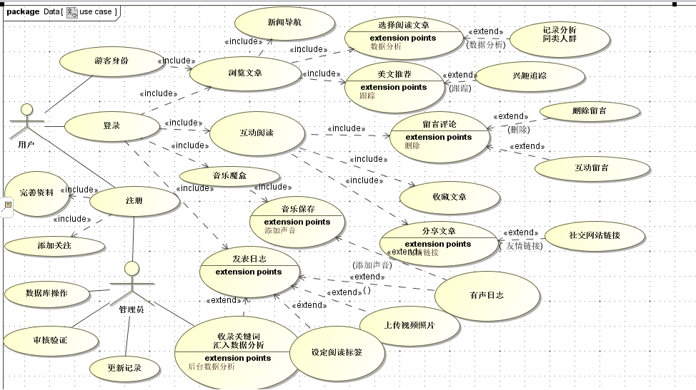
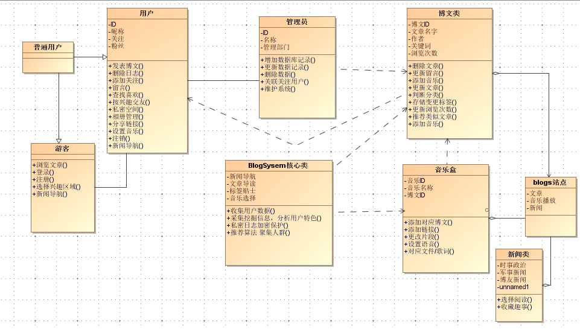
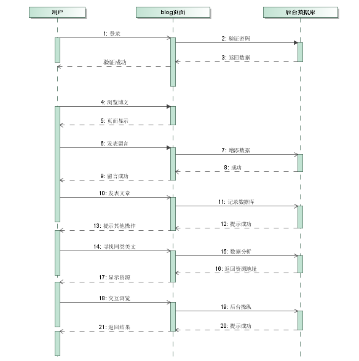
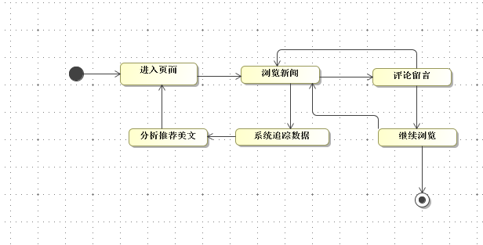
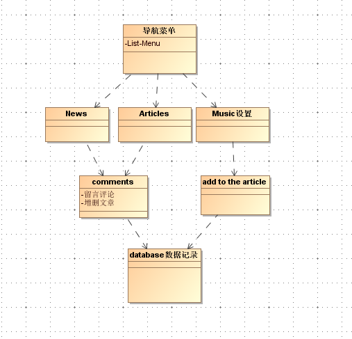
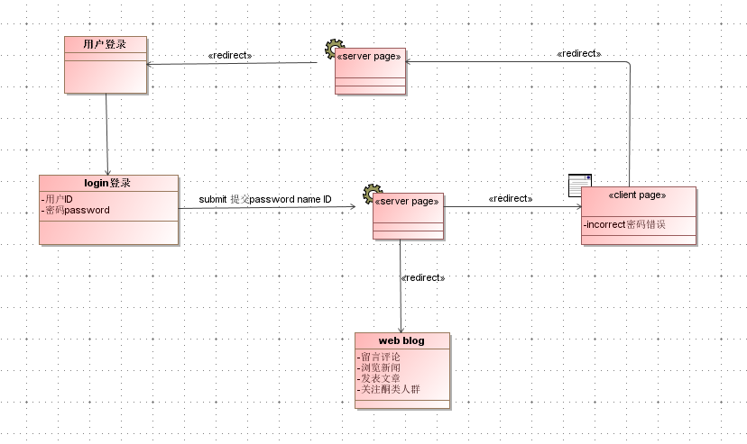

## web应用建模##
建模工具：MagicDrawUML

Web应用建模的特性包括层、方面、阶段和适应性4个方面
### 用例图 ###
功能需求建模，采用UML用例图全局功能建模，确定系统参与者，选定用例

### 活动图 ###

### 类图 ###

### 时序图 ###

### 状态图 ###

### 适应性动态建模 ###
根据用户上下文（context）特性，给用户提供合适的展示

### 超文本静态建模###
目标是通过Web应用的内容构建导航，因此也是导航建模
