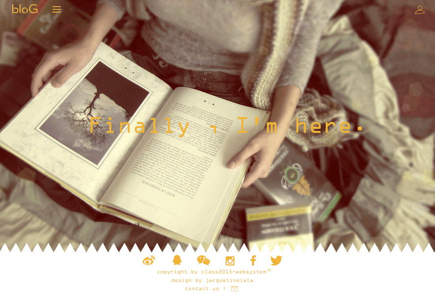

# Web Engineering
## Task 6:UI design
### 张昕昳 jacqueline

**Simple Introduction: Our task is to develop a blog system.**
**（主菜单）**

**Structure:****（结构）**

**1. Main User Presentation Interface****（主界面）**

* Presentation Interface

* Main Menu

* Login Interface

* Register Interface

————————————————————

**2. Main User Interface**
* About Interface

* Blog Interface

* Photos Interface

* If More Icon is touched, the exchange of the interface

* More touched in Shadow

* More Interface

